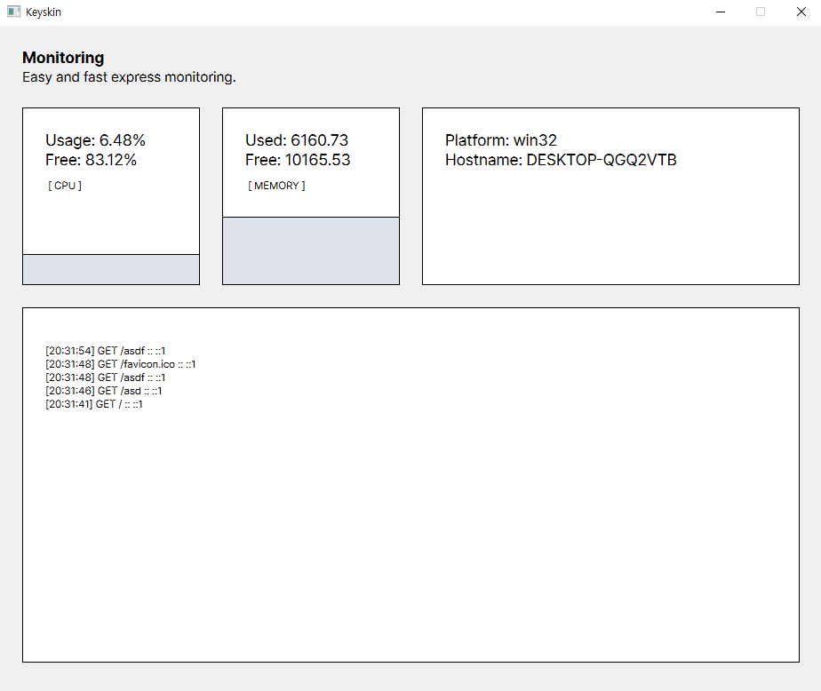

# 💫 Keyskin
Easy and fast express monitoring.

### Preview


### Different from typical monitoring services
- Provides user experience gui.
- Easy and simple monitoring settings.
- Good library for express users.

### Installation
```bash
$ npm install keyskin@latest
```

### Usage
```js
const { default: Keyskin } = require(`keyskin`);

const keyskin = new Keyskin();

keyskin.use((req, res, next) => {
    console.log(req.method);
    next();
});

keyskin.on(`get`, `/json`, (req, res) => {
    res.setHeader(`Content-type`, `application/json`);
    res.send({ a: 1, b: 2, c: 3 });
});

keyskin.listen(8080, () => {
    console.log(`localhost:${keyskin.port}`);
});
```